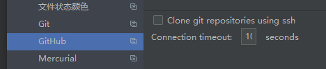

# json.dumps()将字典转换为字符串
```
import json
data = {
    'name' : 'Connor',
    'sex' : 'boy',
    'age' : 26
}
print(data)
print(type(data))#输出原始数据格式
data1=json.dumps(data)
print(data1)
print(type(data1))#输出原始数据格式
print(data1[2])
```
# git rm --cached <文件或文件夹>
取消对文件的追踪

# share到github时报错：connect time out
调大timeout
